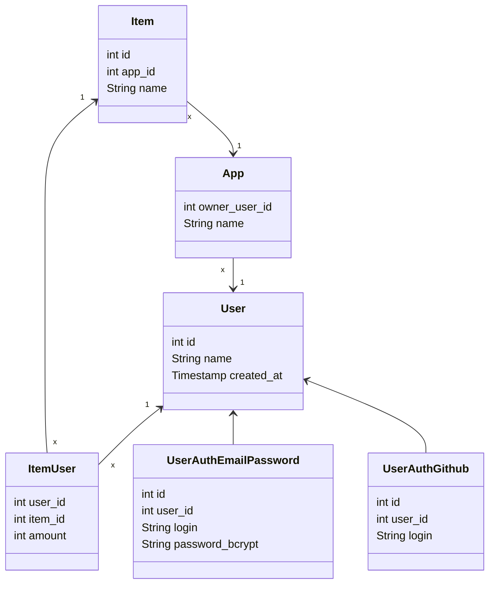

```mermaid
classDiagram
    class User {
        int id
        String name
        Timestamp created_at
    }

    class Item {
        int id
        int app_id
        String name
    }
    class ItemUser {
        int user_id
        int item_id
        int amount
    }
    class App {
        int owner_user_id
        String name
    }
    User "1" <-- "x" ItemUser
    Item "1" <-- "x" ItemUser
    App "x" --> "1" User
    Item "x" --> "1" App

    authentication
    class UserAuthEmailPassword {
        int id
        int user_id
        String login
        String password_bcrypt
    }
    User <-- UserAuthEmailPassword
    class UserAuthGithub {
        int id
        int user_id
        String login
    }
    User <-- UserAuthGithub
```