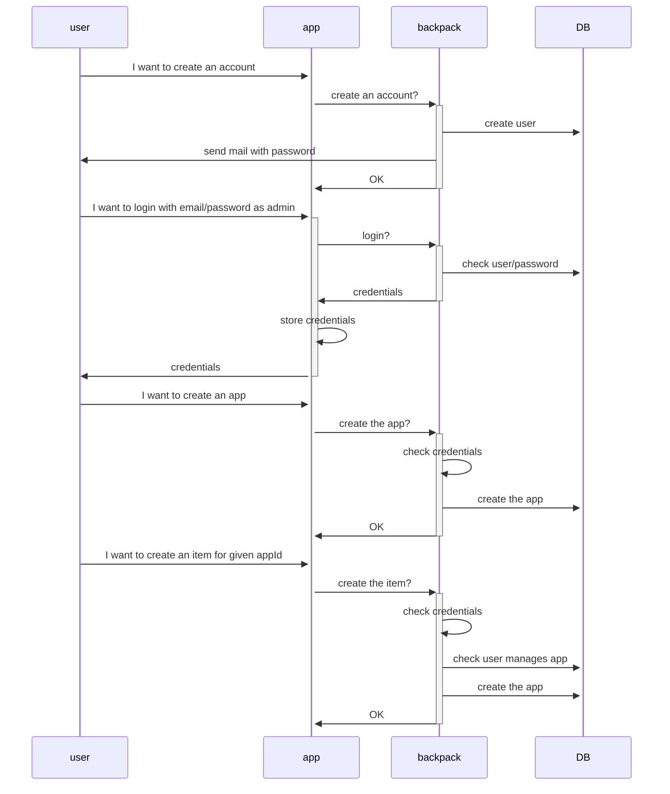

# Admin

The first step to use backpack is to create a user account.

With any user account, you can:
- login as admin
- create an app
- add items to an app you created.

# User

The second step to using backpack is to use items through apps.

## TODO
- login as a user
- use an item (insecurely)
- use an item (securely through a server)
  - it would need to create an "app" password, used by the trusted game server.