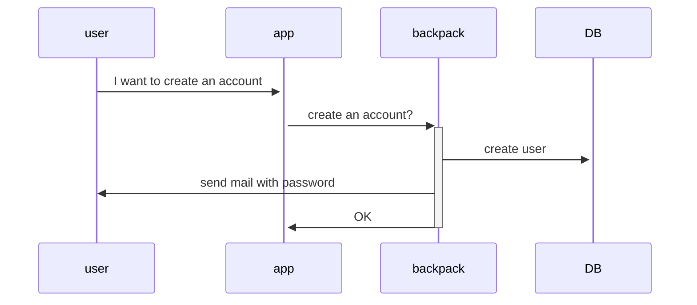
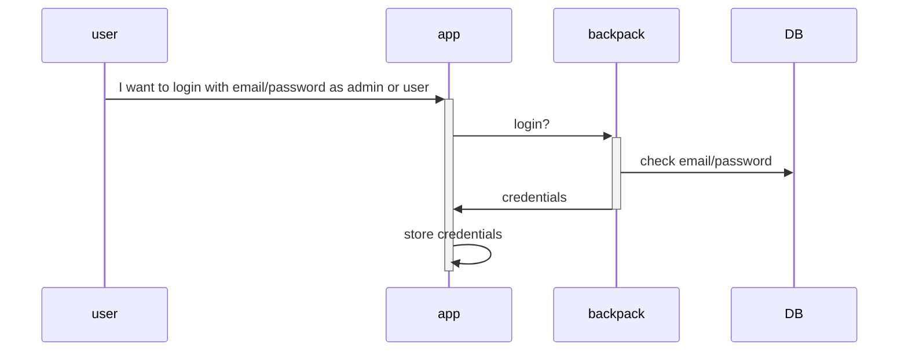
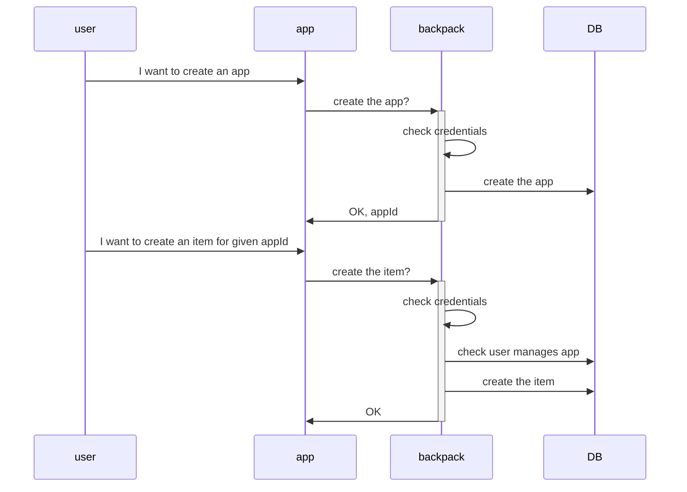
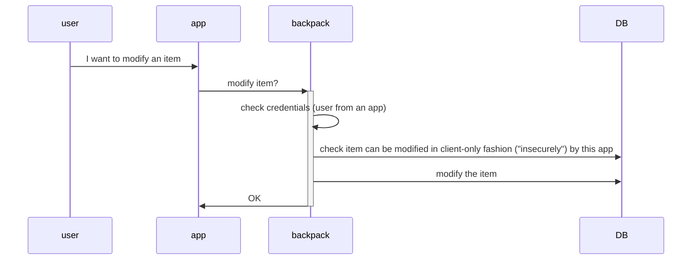
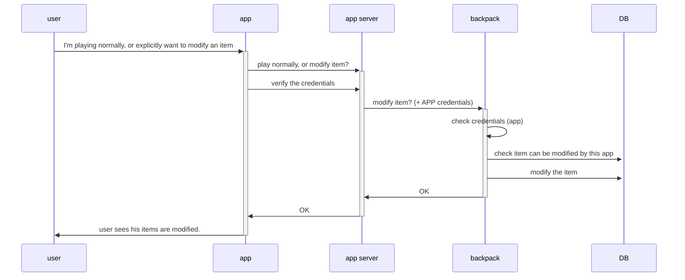

# First steps

The first step to use backpack is to create a user account.

Then you can login either as:

- **admin**: to manage apps and their items
- **user**: to authenticate, and modify your items owned as a player from apps you play.

Once you have your credentials, keep in mind you'll need to refresh these or your session might be terminated. Check how it's done in the [example game](/crates/example_game_lazy)

# Admin

With any user account, you can login as **admin**, then:

- create apps
- add items to an app you created.
- :construction: later, give rights to foreign apps for an item you manage ; with specific rights (read/write/increase/substract ?)

# User

With any user account, you can login as **user**, then use any game using backpack, to modify your items.

## Client-only item modification

The easiest way to modify items is to ask backpack to modify an item from the client app.

:warning: An important rule in software development is to never trust user input.

This solution is considered "insecure", as clients could "easily" cheat by forging requests to ask for unverified modification.

Despite that, it can be useful for:

- fast prototyping, game jams
- non-critical items
  - single player games
  - items not related to balancing
  - items not having a "better" value, such as random seed, population amount in a sandbox city, id for level selection...?
  - ...

## App verified item modification

:construction: WIP, this part would need:

- an app password
- an app role
- maybe a password specific app, to pass to each requests, easier for developers to implement than maintaining a bisuit token.

