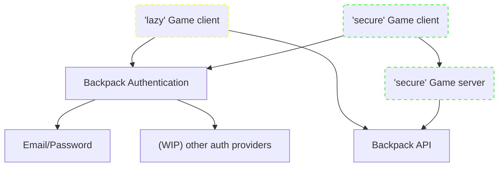

# Backpack

Inventory backend system for **items from different games**.

# Pitch

I have a vision featuring multiple games impacting each others.

Games can be social beyond their limited scope:
> My mom did beat the 6th level of her favorite match3 game, she was able to send me a skin for my favorite FPS!

> My Friend hatched eggs in their clicker game, so I can spawn more dragons in my RTS.

Single players can find their value too:
> I finished my exploration game and gained a garden to use in that other construction game!

> I'm going to play this god-simulation game to add a few planets to my other galaxy-simulation game.

# Getting started

## Understand Backpack
Helpful documentations for the project:

- [sequence diagram](crates/server/docs/sequence.md): to understand the communication flow
- [database class diagram](crates/server/docs/database.md): to understand stored data
- [OpenAPI](crates/server/docs/openapi3_0.yaml): to start consuming the API
- *[Tech scribbles](Docs/Backpack.drawio.png): first diagram of the project, a less professional-looking sequence diagram.*

## :construction: Use Backpack :construction:

From source ?

- setup your secrets
  - see [.env template](/crates/server/.env.template)
- start the backpack server

- Get the url of the Backpack server you connect to. :construction: Official server WIP.
- Use the admin interface to set up items and server to server communication
  - Sign up/Sign in with provided means (email/password or third party (github...))
  - Create an app
  - Create one or several item
  - You will use app's and items' IDs to develop your app which interact with those app/items.

Choose a strategy to update your items, <i>see <a href=crates/backpack-server/docs/sequence.md>sequence diagram</a> for more details</i>

 

  - **Lazy:** Clients call directly to Backpack, potentially enabling users to abuse forging requests.
  - **Secure:** Clients call to another logic server *(which you are responsible of)* to refill or use their items, those operations are done through server-server communication.

# Trust

## Items management

At the core of backpack is a trust system. as an app admin, you will trust any app you give rights to your items, to behave accordingly. There will be rights to limit the kind of operations apps can do on items, but logic is ultimately owned by the trusted app, so beware of who you trust, and how you trust.

A trusted app, who has been given rights to an unowned item, will trust its item's admin to let it use the item, and to be sensible when adding other items' rightholders.

## DDOS

For now, It may be easy to DDOS Backpack, as it's possible technically to create thousands of accounts, apps, items... but I trust users to be responsible.

When the project is more mature, app limits, item limits, and "under attack" mode (freezing admin routes?) will be brought to the discussion.

# Development roadmap

I'm bad at forecasting, but here is a plan:

- v1: minimalist single example game prototype, using backpack as inventory with **Lazy** system.
  - Estimated Date: mid 2023
- v2: 2 minimalist games prototypes, using backpack with shared items, still **Lazy** system
  - Estimated Date: early 2024
- v3: 2 minimalist games prototypes, using **secure** system
  - Estimated Date: late 2024

An admin interface and a Backpack library using [bevy](https://bevyengine.org/) will be worked on alongside these milestones

# Thanks

A lot of code originally inspired by https://github.com/vleue/jornet
