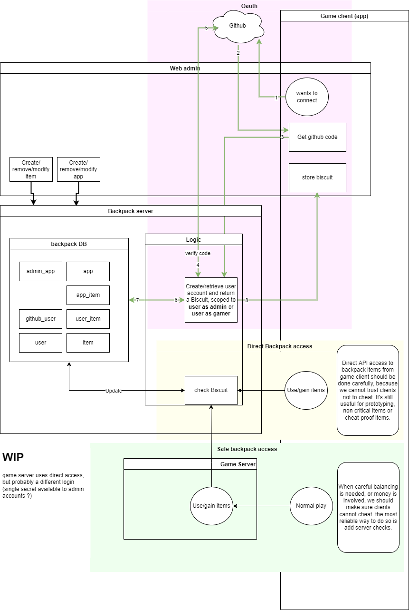

# Backpack

Inventory backend system for shareable items.

# Pitch

I have a vision featuring multiple games impacting each others.

Games can be social beyond their limited scope:
- My mom did beat the 654th level of her favorite match3 game, she was able to send me a skin for my favorite FPS, I love it!
- Hey Friend, thanks for hatching more eggs in your clicker game, so I can spawn more dragons in my RTS

Single players can find their value too:
- I finished my exploration game and gained a garden to use in that other construction game
- I'm going to play this god-simulation game to add a few planets to my other galaxy-simulation game.

# Tech scribbles

## Features

- [ ] authentication via https://www.biscuitsec.org/ ; through third party oauth (github...)
- [ ] Create users via first authentication
- [ ] Create, Read, Update (addition), Delete items (string, int)

## High level usage

- [x] setup your secrets 
  - [x] private key for biscuit
  - [x] oauth third party
  - [x] database connection
- [x] start the backpack server
- [ ] use the admin interface to set up items and server to server communication
- [ ] To signin/signup, client identify through an oauth third party which callbacks to backpack server to create a new user or identify and get a biscuit token.
- [ ] Clients call to another logic server to refill or use their items, those operations should be done through server-server communication. 
- [ ] this logic server uses data from backpack.

# Thanks

A lot of code inspired by https://github.com/vleue/jornet